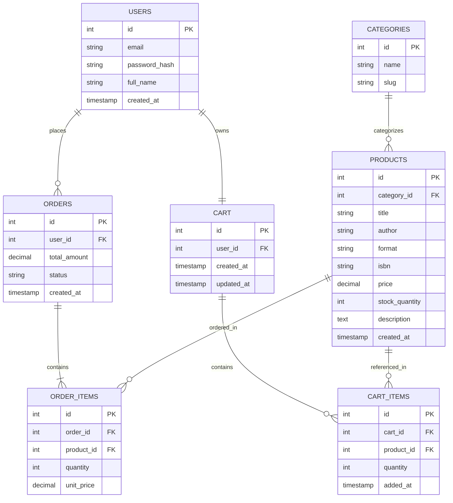

# Sprint 1: System Architecture & Scope Definition

**Project:** BookNest — Books & Digital Media E-Commerce Platform
**Course:** E-Commerce (SDLC Project)
**Sprint:** 1 of 6

---

## Section 1: Target Audience & Market Focus

**Primary Persona:**
Readers aged 18–35 — students, working professionals, and hobbyist readers — who buy books across multiple formats (physical, e-book, audiobook) and want a single platform to browse, purchase, and instantly access their purchases, rather than juggling separate storefronts for print and digital media.

**Core Pain Point:**
Most readers currently split their purchases across a physical bookstore, a Kindle-style e-book store, and a separate audiobook subscription, with no unified cart, order history, or library view. This platform solves that by letting a user buy a physical book, an e-book, and an audiobook in a single checkout, with digital items becoming instantly available post-payment.

**Domain Scope:**
Digital Assets & Media Retail — specifically new books, e-books, and audiobooks. Used-book resale, print-on-demand, and subscription/membership models are out of scope for the MVP.

---

## Section 2: MVP Feature Scope

| Category | Feature Name | Description | Priority |
|---|---|---|---|
| Authentication | User Registration & Authentication | Password hashing (bcrypt) and JWT-based session authentication. | High (MVP) |
| Catalog | Product List & Search | Browsing interface for books/media with filtering by genre, author, and format (physical/e-book/audiobook), plus keyword search. | High (MVP) |
| Cart | Cart Management | Persistent cart supporting mixed physical and digital items — add, update quantity, remove. | High (MVP) |
| Checkout | Order Processing | Mock/Stripe payment gateway integration and order object instantiation. | High (MVP) |
| Catalog | Digital Delivery | On successful payment, generate a secure, time-limited download/access link for e-book and audiobook items. | Medium |
| Admin | Inventory Control | Administrative CRUD operations for product listings and stock levels. | Medium |

---

## Section 3: Tech Stack Selection & Justification

**Deployment target:** Hostinger Premium Web Hosting (shared). This plan gives SSH access and pre-installed Composer, but does **not** run a persistent Node.js process and does **not** support PostgreSQL, MongoDB, or Redis — those require a VPS. The stack below is chosen to run natively on it without needing to upgrade the hosting plan.

**Frontend Framework: React (Vite)**
Justification: Built as a static SPA (`npm run build`), the output is plain HTML/CSS/JS that can be uploaded directly to `public_html` — no Node.js runtime needed at request time, which matches what shared hosting can actually serve. Vite keeps the build simple compared to a full SSR framework whose server-rendering features would be unusable here anyway.

**Backend Infrastructure: Laravel (PHP)**
Justification: PHP and Composer are natively supported on Hostinger's Web hosting tiers (Premium and above), so the API runs without needing the Business-plan-only Node.js hosting feature. Laravel's Eloquent ORM, migration system, and Sanctum package cover the authentication and REST API needs of the SPA frontend with minimal boilerplate.

**Database Management System: MySQL**
Justification: MySQL is the only database engine available on Hostinger Web hosting plans (PostgreSQL is VPS-only), and Laravel's migrations and Eloquent work natively with it. The relational structure required here — users, orders, order items, inventory — doesn't depend on any PostgreSQL-specific feature, so this is a straightforward fit rather than a compromise.

**Caching & Asynchronous Processing (Optional): Laravel's file/database cache and queue drivers**
Justification: Redis isn't available on Web hosting plans, so catalog/search results are cached via Laravel's built-in file cache driver instead, and order-confirmation / digital-delivery emails are dispatched through Laravel's database-backed queue — both work without any extra service to install.

---

## Section 4: Entity-Relationship Diagram (ERD)

**Cardinality summary:**
- One `USER` places many `ORDERS` (1:N)
- One `USER` owns exactly one `CART` (1:1)
- One `CART` contains many `CART_ITEMS` (1:N)
- One `PRODUCT` can appear in many `CART_ITEMS` (1:N)
- One `ORDER` contains one or more `ORDER_ITEMS` (1:N, minimum 1)
- One `PRODUCT` can appear in many `ORDER_ITEMS` (1:N)
- One `CATEGORY` classifies many `PRODUCTS` (1:N)

**Notes on keys and constraints:**
- `PRODUCTS.category_id` is a required FK to `CATEGORIES.id`.
- `CART.user_id` is a unique FK to `USERS.id`, enforcing the 1:1 cart-per-user relationship.
- `CART_ITEMS.cart_id` and `CART_ITEMS.product_id` are both required FKs; `(cart_id, product_id)` should be unique so a product appears at most once per cart (quantity handles multiples).
- `ORDER_ITEMS.order_id` and `ORDER_ITEMS.product_id` are both required FKs.
- `ORDER_ITEMS.unit_price` stores the price at time of purchase (denormalized intentionally) so historical orders remain accurate if `PRODUCTS.price` changes later.
- `format` on `PRODUCTS` is constrained at the application layer to one of `physical`, `ebook`, `audiobook`.
