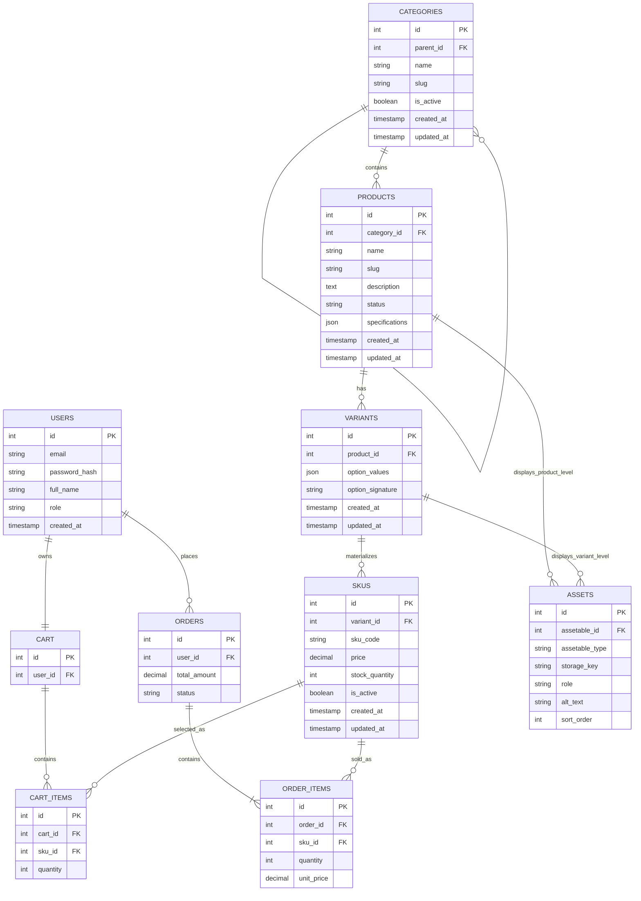

# Sprint 2: Catalog Data Foundation

**Project:** BookNest — Books & Digital Media E-Commerce Platform
**Sprint:** 2 of 6 (Days 1–15)
**Status:** Design phase complete. Implementation (migrations, admin API, seed data, tests) not yet built — sections 6 and 7 describe the plan and will be replaced with captured evidence once the code exists.

---

## 1. Sprint Goal and Scope Boundary

**Goal:** Given a product catalog administrator, the system must persist categories, products, variants, and SKUs without losing identity, relationship, price, or inventory meaning.

**In scope this sprint:**
- Category tree (stable IDs, slugs, parent/child).
- Product creation/editing with status and descriptive content.
- Variants and SKUs with unique codes, price, and stock.
- Authenticated admin CRUD for all four.
- Constraints, migrations, seed data, and tests.

**Explicitly out of scope (deferred to Sprint 3+):** dynamic specification *authoring UI*, asset upload, public catalog search/read endpoints, publication workflows beyond a basic status field, payment integration, order placement, shipping, and the shopper-facing checkout flow. The `assets` and `specifications` storage is modeled in this sprint's ERD (required by the brief) but not built out functionally.

---

## 2. Link to Sprint 1 Decisions

Reused without change:
- **Stack:** React (Vite) frontend, Laravel (PHP) backend, MySQL database, deployed on Hostinger Premium Web Hosting via SSH + Composer. No Node.js runtime, no PostgreSQL, no Redis — still holds for Sprint 2.
- **Users, Orders** entities and their relationship to Carts — unchanged.
- **Auth approach:** JWT-style stateful auth via Laravel Sanctum, as implied by Sprint 1's "JWT-based authentication" line.

Changed, with justification:
- **`users` gains a `role` column** (`enum('customer','admin')`, default `customer`). Sprint 1 didn't need an authorization tier; CAT06 now requires distinguishing admin write access, so this is a small additive migration rather than a redesign.
- **`cart_items` and `order_items` now reference `sku_id`, not `product_id`.** Sprint 1 assumed a product had one price and one stock count. Sprint 2 moves price and stock down to the SKU level (CAT03), so a product alone is no longer a sellable, priced thing — only a SKU is. Keeping `cart_items`/`order_items` pointed at `product_id` would leave price/stock ambiguous whenever a product has more than one SKU. This is a deviation from the sprint brief's illustrative diagram (which shows `cart_items` still tied to `products`); it's made deliberately so a cart line always resolves to one specific priced, sellable unit, the same way an order line already does.
- **`products.price` and `products.stock_quantity` are removed.** They move to `skus` (see below) — a product is now a container for variants/SKUs, not a sellable unit itself.

---

## 3. Updated ERD and Data Dictionary



*Note on Assets:* Mermaid can't express a true polymorphic relation, so the diagram shows two lines. The actual table is a single `assets` table with `assetable_id` + `assetable_type` (Laravel's `morphTo` convention), not two separate foreign keys.

### Data dictionary — key columns and rules

| Table | Column | Type | Rule |
|---|---|---|---|
| categories | slug | VARCHAR(150) | UNIQUE |
| categories | parent_id | BIGINT UNSIGNED, nullable | FK → categories.id, ON DELETE RESTRICT, ON UPDATE CASCADE |
| products | slug | VARCHAR(180) | UNIQUE |
| products | category_id | BIGINT UNSIGNED | FK → categories.id, ON DELETE RESTRICT |
| products | status | ENUM('draft','published','archived') | default `draft` |
| products | specifications | JSON, nullable | flat object only — see validation rule below |
| variants | product_id | BIGINT UNSIGNED | FK → products.id, ON DELETE CASCADE |
| variants | option_signature | VARCHAR(191) | derived from sorted `option_values`; UNIQUE with `product_id` (prevents duplicate combinations — CAT04) |
| skus | variant_id | BIGINT UNSIGNED | FK → variants.id, ON DELETE RESTRICT |
| skus | sku_code | VARCHAR(64) | UNIQUE |
| skus | price | DECIMAL(10,2) UNSIGNED | no floats, per CAT03/required money rule |
| skus | stock_quantity | INT UNSIGNED | default 0; DB `CHECK (stock_quantity >= 0)` where the provisioned MySQL version supports it (8.0.16+), with an application-level atomic guard as the primary backstop regardless of version |
| cart_items | sku_id | BIGINT UNSIGNED | FK → skus.id, ON DELETE RESTRICT |
| order_items | sku_id | BIGINT UNSIGNED | FK → skus.id, ON DELETE RESTRICT |

**Specification validation rule:** `specifications` must be a flat JSON object (no nested arrays/objects), max 20 keys, keys are `snake_case` strings, values are string/number/boolean only. Enforced by a custom Laravel validation rule (`ValidFlatSpecJson`) on write, not just at the DB layer, since MySQL's `JSON` type only guarantees valid JSON syntax, not this shape.

**Cycle prevention for categories:** a self-referencing FK alone can stop a row pointing directly at itself, but not a multi-level cycle (A → B → C → A). That's enforced at the application layer — before saving a `parent_id` change, the service walks the ancestor chain of the proposed parent and rejects the update if the category being edited appears in it.

---

## 4. Administration Route Table

| Method | Route | Auth | Purpose |
|---|---|---|---|
| POST | `/api/v1/admin/categories` | admin | Create category |
| GET | `/api/v1/admin/categories` | admin | List category tree |
| POST | `/api/v1/admin/products` | admin | Create draft product |
| PATCH | `/api/v1/admin/products/:id` | admin | Update product content/status |
| GET | `/api/v1/admin/products` | admin | List admin product records |
| POST | `/api/v1/admin/products/:id/variants` | admin | Add a variant |
| POST | `/api/v1/admin/products/:id/skus` | admin | Add a SKU (via its variant) |
| PATCH | `/api/v1/admin/skus/:id` | admin | Update price/stock/active status |

**Planned example — create a SKU:**

Request:
```http
POST /api/v1/admin/products/14/skus
Authorization: Bearer <token>
Content-Type: application/json

{
  "variant_id": 31,
  "sku_code": "BOOK-DUNE-PBK-EN",
  "price": 12.99,
  "stock_quantity": 40
}
```

Success response (`201`):
```json
{
  "data": {
    "id": 88,
    "variant_id": 31,
    "sku_code": "BOOK-DUNE-PBK-EN",
    "price": "12.99",
    "stock_quantity": 40,
    "is_active": true
  }
}
```

Duplicate SKU code (`422`, not a stack trace, per CAT05):
```json
{
  "message": "The given data was invalid.",
  "errors": {
    "sku_code": ["A SKU with this code already exists."]
  }
}
```

Unauthenticated write (`401`):
```json
{ "message": "Unauthenticated." }
```

These are the intended request/response shapes the implementation will match; once built, this section should be replaced with real captured output.

---

## 5. Data Integrity and Authorization Decisions

- **DB constraints are the source of truth, API validation is the first line of defense (CAT05).** Every uniqueness/FK rule in the data dictionary above exists at the database level, not only in request validation, so a race condition or a bypassed endpoint can't corrupt data.
- **Admin routes are protected by Sanctum + a `role = admin` gate.** A valid token alone isn't sufficient — a logged-in customer hitting an admin route gets `403`, not `401`.
- **Products and categories are never hard-deleted through the API**, only deactivated (`is_active` / `status`), so history stays intact. Hard deletion of a never-published, never-referenced row is a direct-DB maintenance action, not an exposed endpoint.

**Business rules and edge cases:**

1. **Can a draft product have no SKU?** Yes — a draft is expected to exist while content is prepared. **Can a published product have no sellable SKU?** No — the draft→published transition checks for at least one active SKU and rejects the status change otherwise.
2. **One category or many?** One canonical category per product (`products.category_id`). This matches CAT02's singular "category assignment" and avoids many-to-many complexity the MVP doesn't need; a secondary "tags" table could be added later without touching this FK.
3. **Parent category deactivated:** children are *not* auto-deactivated — that would be a silent, cascading side effect. Instead, a product is treated as effectively unlisted if *any* ancestor category is inactive, computed at read time, while each category's own `is_active` flag stays exactly as the admin set it.
4. **Out-of-stock SKU in a public response:** still returned (not hidden), with a computed `"available": false` field when `stock_quantity = 0`. Public read endpoints themselves are Sprint 3 scope, but the admin API already exposes this shape so Sprint 3 can reuse it.
5. **Can two SKUs share a price?** Yes, no constraint prevents it. **Price override?** `skus.price` is the single source of truth — there's no separate product-level base price a SKU "overrides," which avoids a dual-source-of-truth bug at the cost of not yet supporting a promo/discount layer (noted in limitations).
6. **Negative stock / duplicate codes:** `sku_code` has a UNIQUE index; stock decrements happen via a conditional atomic update (`WHERE stock_quantity >= :qty`), backed by a DB `CHECK` constraint where the MySQL version supports it.
7. **Product referenced by a cart/order after deactivation:** because `cart_items`/`order_items` point at `sku_id`, and SKUs are only ever deactivated (never hard-deleted), historical rows keep resolving correctly. Deactivating a product/SKU blocks *new* cart additions but doesn't touch existing rows — `order_items.unit_price` already snapshots the purchase-time price, so past orders stay accurate regardless of later catalog changes.

---

## 6. Seed Data and Demonstration Plan

Planned seed set (meets the ≥2 categories / ≥3 products / ≥4 SKUs / 1 multi-variant / 1 unavailable-combination minimums):

- **Categories:** `Books` (root) → `Fiction` (child).
- **Products:**
  1. *Dune* — under Fiction, two variants (Paperback/English, E-book/English), one SKU each.
  2. *Atomic Habits* — under Books, single default variant, one SKU.
  3. *The Pragmatic Programmer* — under Books, two variants (Paperback, Audiobook), where the Audiobook variant is created **without** a SKU — the intentionally unavailable combination required by the brief.
- **SKUs:** 4 total across the above (Dune × 2, Atomic Habits × 1, Pragmatic Programmer Paperback × 1).

Demonstration flow to capture once built: admin logs in → creates the `Fiction` category → creates *Dune* as a draft → adds its two variants → adds a SKU to each → attempts to publish *The Pragmatic Programmer* with its SKU-less Audiobook variant and confirms the publish rule from §5.1 rejects it appropriately → retrieves both records via `GET /api/v1/admin/products`. Request/response evidence from this run will replace this paragraph.

---

## 7. Test Strategy (Planned)

| Area | Test |
|---|---|
| Model | Category slug uniqueness, product slug uniqueness |
| Model | Variant `option_signature` uniqueness per product (CAT04) |
| Model | SKU `sku_code` uniqueness |
| Validation | Reject duplicate slug / duplicate SKU code with `422`, not a 500 |
| Business rule | Category cycle prevention (A→B→C→A rejected) |
| Business rule | Publish rejected when product has zero active SKUs |
| Business rule | Stock update can't go negative |
| Authorization | Non-admin gets `403` on every admin route; unauthenticated gets `401` |

Planned framework: PHPUnit (Laravel's default), run via `php artisan test`. Command and pass/fail output will be recorded here once the suite exists — no results are claimed yet.

---

## 8. Known Limitations and Sprint 3 Backlog

- No promo/discount pricing layer — `skus.price` is flat.
- No public-facing read endpoints yet (admin-only this sprint, as scoped).
- Asset upload and the `specifications` authoring UI are schema-only placeholders this sprint.
- `option_signature` generation logic (for variant dedup) still needs a canonical-ordering spec written down before implementation, to guarantee `{color: black, size: M}` and `{size: M, color: black}` hash identically.
- Sprint 3 should build on `skus` and `variants` as-is rather than reintroducing product-level price/stock, and can begin public catalog reads directly against the `is_active`/`status` fields already modeled here.
